<div align="center">



# 💬 GitHub Readme Animated Chat Bubbles

**Generate pixel-perfect animated messaging UIs directly in your GitHub profile README.**  
Built with pure Python + SVG. No dependencies, no build step, no JavaScript.

[](https://python.org)
[](https://developer.mozilla.org/en-US/docs/Web/SVG)
[](LICENSE)

</div>

---

## What is this?

A lightweight Python script that reads a parametric SVG template, injects your custom messages, auto-calculates all dimensions, and outputs a fully animated SVG chat conversation, ready to drop into any GitHub README.

The result looks like a real iMessage-style conversation: typing indicators appear first, then each bubble pops in with a smooth spring animation, alternating between left (received) and right (sent) sides.

---

## How It Works

The project is split into three layers:

```
template.svg   ←  parametric SVG with {VARIABLE} placeholders
chat.py        ←  Python engine: fills variables, computes geometry, writes output
chat.svg       ←  generated output, ready to embed
```

### 1. The Template System

`template.svg` is a standard SVG file where every dynamic value is expressed as a `{VARIABLE}` placeholder. The Python script does a pure string-replace pass. No XML parser, no external library.

All placeholders are resolved at generation time:

| Variable       | Type     | Description                                  |
| -------------- | -------- | -------------------------------------------- |
| `{MSG_1}`      | string   | Text content of message 1 (left / received)  |
| `{MSG_2}`      | string   | Text content of message 2 (right / sent)     |
| `{MSG_3}`      | string   | Text content of message 3 (left / received)  |
| `{MSG_4}`      | string   | Text content of message 4 (right / sent)     |
| `{W_MSG_1}`    | int (px) | Bubble width for message 1, auto-computed    |
| `{W_MSG_2}`    | int (px) | Bubble width for message 2, auto-computed    |
| `{W_MSG_3}`    | int (px) | Bubble width for message 3, auto-computed    |
| `{W_MSG_4}`    | int (px) | Bubble width for message 4, auto-computed    |
| `{X_MSG_2}`    | int (px) | X position of right bubble 2 (right-aligned) |
| `{X_MSG_4}`    | int (px) | X position of right bubble 4 (right-aligned) |
| `{X_TYPING_2}` | int (px) | X offset of typing indicator for message 2   |
| `{X_TYPING_4}` | int (px) | X offset of typing indicator for message 4   |
| `{SVG_HEIGHT}` | int (px) | Total SVG canvas height, auto-computed       |

### 2. Auto Width Calculation

Each bubble's width is computed from the message text length using a linear formula:

```python
def calculer_largeur(texte):
    return int(len(texte) * 7.5) + 35
```

- `7.5 px` per character, calibrated for the system font stack at 15px
- `+ 35 px`, fixed horizontal padding (left + right inset)

This ensures every bubble wraps tightly around its content without overflow or clipping.

### 3. Right-Alignment for Sent Bubbles

Sent messages (right side) are positioned by calculating their X offset from the right edge of the 600px canvas:

```python
x2 = 590 - w2   # 590 = canvas width (600) minus 10px right margin
x4 = 590 - w4
```

The typing indicator for each right-side message is offset relative to its own bubble width so it appears flush-right:

```python
x_typing2 = w2 - 65   # 65 = typing bubble fixed width
x_typing4 = w4 - 65
```

### 4. Dynamic Canvas Height

The total SVG height is not hardcoded: it is derived from the Y position of the last message:

```python
svg_height = MSG_Y_POSITIONS[-1] + BUBBLE_HEIGHT + PADDING_BOTTOM
```

With the default layout constants:

```python
BUBBLE_HEIGHT = 42        # height of every message bubble (px)
PADDING_BOTTOM = 15       # breathing room below the last bubble (px)
MSG_Y_POSITIONS = [20, 70, 120, 170]  # Y anchor for each of the 4 messages
```

This means adding more messages only requires extending `MSG_Y_POSITIONS`. The canvas resizes automatically.

---

## Animation System

All animations are pure CSS `@keyframes` defined inside the SVG `<style>` block. No JavaScript, no GIF conversion. They work natively in any browser and in GitHub's SVG renderer.

### Keyframes

| Name          | Behavior                                                                  |
| ------------- | ------------------------------------------------------------------------- |
| `wait`        | Keeps the element invisible (`opacity: 0`) for a delay period             |
| `fade-in-out` | Fades in, holds visible, then fades out. Used for typing indicators.      |
| `pop-left`    | Slides in from slightly below with an opacity fade. For received bubbles. |
| `pop-right`   | Slides in from slightly below with an opacity fade. For sent bubbles.     |

### Staggered Timeline

Each message follows a two-phase pattern: **typing indicator → bubble pop-in**.

```
0.0s  ──▶  Typing indicator 1 appears   (fade-in-out, 1.5s duration)
1.5s  ──▶  Message 1 pops in            (pop-left,    0.2s, stays)

2.5s  ──▶  Typing indicator 2 appears   (fade-in-out, 1.5s duration)
4.0s  ──▶  Message 2 pops in            (pop-right,   0.2s, stays)

5.0s  ──▶  Typing indicator 3 appears   (fade-in-out, 1.5s duration)
6.5s  ──▶  Message 3 pops in            (pop-left,    0.2s, stays)

7.5s  ──▶  Typing indicator 4 appears   (fade-in-out, 1.5s duration)
9.0s  ──▶  Message 4 pops in            (pop-right,   0.2s, stays)
```

Each CSS class pairs a `wait` animation (holds invisible) with the actual motion animation using a delay:

```css
.msg-1 {
  animation:
    wait 1.5s,
    pop-left 0.2s 1.5s forwards;
  opacity: 0;
}
```

The `forwards` fill mode locks the bubble in its final visible state after the pop-in completes.

### Typing Indicator (Bouncing Dots)

Each typing bubble contains three circles animated with SMIL `<animate>`, looping **indefinitely** and independently of the CSS layer:

```xml
<circle cx="16" cy="21" r="4.5" fill="#999">
    <animate attributeName="cy" values="21;15;21" dur="0.7s"
             begin="0s" repeatCount="indefinite"
             calcMode="spline" keySplines="0.4 0 0.6 1;0.4 0 0.6 1" />
</circle>
```

Each dot is offset by `0.15s` (`begin="0s"`, `"0.15s"`, `"0.30s"`) to create the classic staggered wave effect.

---

## Visual Design

| Property      | Received (left)                              | Sent (right)               |
| ------------- | -------------------------------------------- | -------------------------- |
| Background    | `#E9E9EB` (light grey)                       | `#34C759` (iMessage green) |
| Text color    | `#000000`                                    | `#ffffff`                  |
| Font          | System UI stack (SF Pro / Segoe UI / Roboto) | Same                       |
| Font size     | 15px                                         | 15px                       |
| Border radius | `rx="21"` (pill shape)                       | Same                       |
| Bubble height | 42px (fixed)                                 | Same                       |
| Canvas width  | 600px                                        | 600px                      |
| Left margin   | 10px                                         | auto (right-anchored)      |

---

## Project Structure

```
.
├── chat.py         # generator: reads template, fills variables, writes output
├── template.svg    # parametric SVG template with {VARIABLE} placeholders
├── chat.svg        # generated output (committed as example)
└── prez.svg        # standalone demo SVG (pre-rendered, used in this README)
```

---

## Usage

### 1. Clone the repository

```bash
git clone https://github.com/Thesirix/github-readme-animated-chat-bubbles.git
cd github-readme-animated-chat-bubbles
```

### 2. Edit your messages

Open `chat.py` and change the four message strings:

```python
msg1 = "Hi! What kind of magic do you do?"        # received (left)
msg2 = "I'm a software developer in Marseille! ☀️" # sent (right)
msg3 = "What's your favorite spell?"               # received (left)
msg4 = "Saying 'It works on my Windows machine' 🪄" # sent (right)
```

### 3. Generate the SVG

```bash
python chat.py
# → done !
```

This overwrites `chat.svg` with your new conversation.

### 4. Embed in your README

Copy `chat.svg` to your profile repository and add:

```markdown
<div align="center">
  
</div>
```

> GitHub renders SVG files natively inside `` tags. CSS animations and SMIL animations both run, no external hosting required.

---

## Customization

### Change the color theme

Edit the CSS classes in `template.svg`:

```css
/* Received bubbles */
.bubble-left {
  fill: #e9e9eb;
} /* try #1C1C1E for dark mode */
.text-left {
  fill: #000000;
}

/* Sent bubbles */
.bubble-right {
  fill: #34c759;
} /* try #0A84FF for iMessage blue */
.text-right {
  fill: #ffffff;
}
```

### Change animation timing

Each message's delay is controlled by two classes in `template.svg`. For example, to speed up the whole sequence, reduce all delay values proportionally:

```css
.msg-2 {
  animation:
    wait 4s,
    pop-right 0.2s 4s forwards;
}
/*                        ^^^^                  ^^^^   ← both must match */
```

### Add more messages

1. Add new Y positions in `chat.py`:
   ```python
   MSG_Y_POSITIONS = [20, 70, 120, 170, 220]  # add 220 for msg 5
   ```
2. Add the corresponding `{MSG_5}`, `{W_MSG_5}`, etc. placeholders in `template.svg`
3. Add the matching `<g>` block with `.type-5` / `.msg-5` animation classes
4. Wire up the new variables in `chat.py`

### Width calibration

If your font renders differently, tune the character width multiplier in `calculer_largeur`:

```python
def calculer_largeur(texte):
    return int(len(texte) * 7.5) + 35
    #                       ^^^
    #                       increase if text overflows, decrease if too much padding
```

---

## Requirements

- Python 3.x (no third-party packages)
- Any SVG-capable viewer (GitHub, browser, VS Code)

---

## License

MIT. Do whatever you want, a star is always appreciated ⭐
